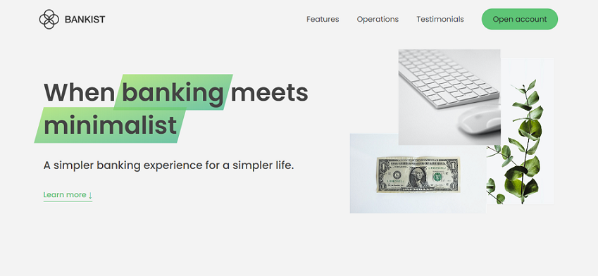

# About
Web application made during [The Complete JavaScript Course](https://www.udemy.com/course/the-complete-javascript-course/) in order to practice javascript.

## Overview

### Screenshot

### Links

- Project link: (https://alan589.github.io/bankist-website/)

## My process

### Built with

- Semantic HTML5 markup
- CSS custom properties
- Flexbox
- JavaScript
- 
### What I learned

- Advanced DOM
- Events

## Author

- Linkedin - [Alan cavalcante](https://www.linkedin.com/in/alan--cavalcante/)

